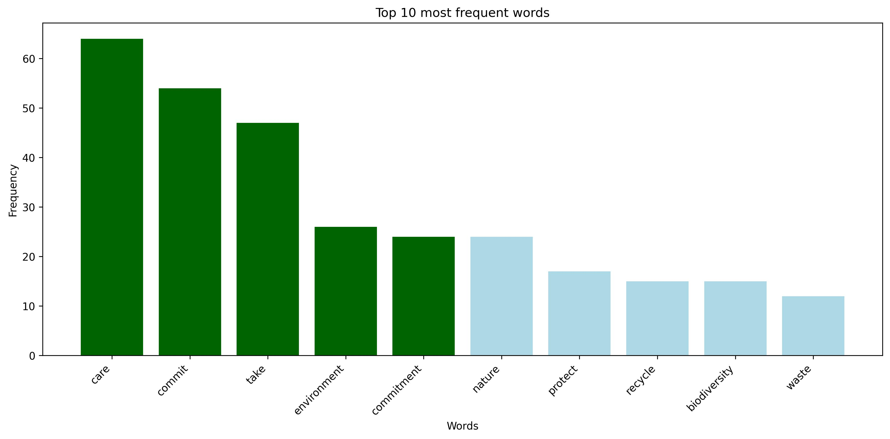

Cloudy
-----
**Author**: Mauricio Peñuela

Cloudy is a Python tool for analyzing survey text responses and identifying the most frequent words.
It generates a **word cloud**, a **word frequency table**, and a **bar chart** showing the top 10 most common words.
The script is interactive and supports both **English** and **Spanish**.

Input data should be provided as a **.txt** file, with **one phrase per line** and **without headers**.
Make sure all dependencies are installed before running the script, and always **activate your virtual environment**.

If you find the installation process difficult `Use Cloudy using Colab  <https://colab.research.google.com/drive/1rk9aQY_qj_k7P9ox0Dlp9ygpsqKenAtp?usp=sharing>`_

`Instrucciones en Español <https://github.com/maurope/cloudy/blob/main/README_es.rst>`_

Setup
-----
Clone the repository::

	git clone git@github.com:maurope/cloudy.git

Then, start a new virtual environment using **Python version 3.12**::

	python3.12 -m venv venv

Initialize virtual environment::
git 
	source venv/bin/activate

Requirements
-----

Install dependencies::

	pip install -r requirements.txt

Download **spaCy** models::

	python3 -m spacy download en_core_web_sm
	python3 -m spacy download es_core_news_sm

Download **NLTK** data::

	python3 -c "import nltk; nltk.download('punkt'); nltk.download('stopwords')"

Usage
-----

Open a **Linux** terminal, navigate to the directory where Cloudy is located, and activate the virtual environment::

	source venv/bin/activate

Then, start **Cloudy** by running the Python command followed by the path to the document you want to analyze::

	python cloudy.py <your_data.txt> 

The console will prompt you to select the language for analysis.
Type **en** for **English** or **es** for **Spanish**, and press **Enter**

Once the script finishes running, your results will be saved in the **output** folder.
All generated analyses and visualizations will be stored within this directory.

Output
-----

