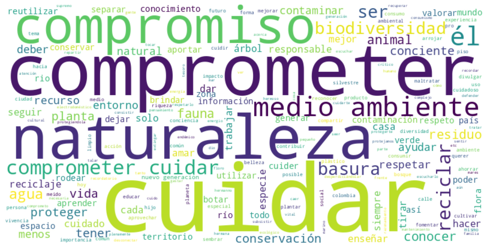
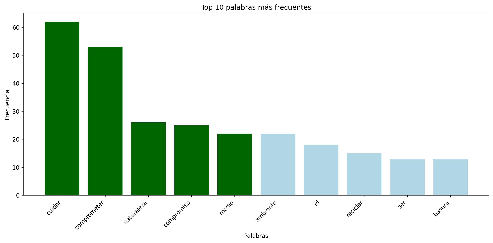

Cloudy
======
**Autor:** Mauricio Peñuela

Cloudy es una herramienta en Python para analizar respuestas textuales de encuestas e identificar las palabras más frecuentes.
Genera una **nube de palabras**, una **tabla de frecuencias** y un **gráfico de barras** con las 10 palabras más comunes.
El script es **interactivo** y admite tanto **inglés** como **español**.

Los datos de entrada deben proporcionarse en un archivo **.txt**, con **una frase por línea** y **sin encabezados**.
Asegúrate de haber instalado todas las dependencias antes de ejecutar el script y de **activar siempre tu entorno virtual**.

Configuración
-------------

Clona el repositorio::

    git clone git@github.com:maurope/cloudy.git

Luego, crea un nuevo entorno virtual utilizando **Python versión 3.12**::

    python3.12 -m venv venv

Activa el entorno virtual::

    source venv/bin/activate

Requisitos
----------

Instala las dependencias::

    pip install -r requirements.txt

Descarga los modelos de **spaCy**::

    python3 -m spacy download en_core_web_sm
    python3 -m spacy download es_core_news_sm

Descarga los datos de **NLTK**::

    python3 -c "import nltk; nltk.download('punkt'); nltk.download('stopwords')"

Uso
---

Abre una terminal de **Linux**, navega hasta el directorio donde está Cloudy y activa el entorno virtual::

    source venv/bin/activate

Luego, ejecuta **Cloudy** usando el comando de Python seguido de la ruta del archivo que deseas analizar::

    python cloudy.py <tu_archivo.txt>

La consola te pedirá seleccionar el idioma para el análisis.
Escribe **en** para **inglés** o **es** para **español**, y presiona **Enter**.

Una vez que el script termine de ejecutarse, tus resultados se guardarán en la carpeta **output**.
Todos los análisis y visualizaciones generados se almacenarán dentro de este directorio.

Resultados
-----

